Appendix
================

<script id="MathJax-script" async src="https://cdn.jsdelivr.net/npm/mathjax@3/es5/tex-mml-chtml.js"></script>

# Loading the Necessary Packages (Libraries)

``` r
# Pack function: install and load more than one  R packages.
# Check to see if packages are installed. 
# Install them if they are not, 
# Then load them into the R session.

pack <- function(lib){
    new.lib <- lib[!(lib %in% 
                     installed.packages()[, "Package"])]
    if (length(new.lib)) 
        install.packages(new.lib, dependencies = TRUE)
    sapply(lib, require, character.only = TRUE)
}

# usage
packages <- c('astsa', 'xts', 'tidyquant', 'quantmod', 'tidyverse', 'dplyr', 
              'pander', 'fpp2', 'broom', 'caret', 'factoextra', 'corrplot', 
              'e1071', 'rugarch')
pack(packages)
```

    ##      astsa        xts  tidyquant   quantmod  tidyverse      dplyr     pander 
    ##       TRUE       TRUE       TRUE       TRUE       TRUE       TRUE       TRUE 
    ##       fpp2      broom      caret factoextra   corrplot      e1071    rugarch 
    ##       TRUE       TRUE       TRUE       TRUE       TRUE       TRUE       TRUE

# Preprocessing - Initial Steps

``` r
# get (read-in) data for the last 10 years 
start = as.Date("2011-11-30") # start date
end = as.Date("2021-11-30")   # end date

# data might not be available for entirety of date range
# but a 10 year look back is done to accommodate full size and scope
getSymbols(c("LTC-USD"), 
           src = "yahoo", 
           from = start, 
           to = end)
```

    ## [1] "LTC-USD"

# Exploratory Data Analysis (EDA)

``` r
# cast litecoin time series into dataframe
litecoin_df <- data.frame(`LTC-USD`) 
colnames(litecoin_df) <- c("Open", "High", "Low", "Close", "Volume", "Adjusted")

litecoin.ts <- tq_get("LTC-USD", from = "2011-11-30", to = "2021-11-30") %>%
select(adjusted) %>% # adjusted price (more accurate than close price)
ts(.) # turning it into a time series object
ltc_xts <- as.xts(litecoin_df)
str(litecoin_df); str(litecoin.ts)
```

    ## 'data.frame':    2632 obs. of  6 variables:
    ##  $ Open    : num  5.09 5.07 4.69 4.33 4.26 ...
    ##  $ High    : num  5.17 5.07 4.76 4.62 4.3 ...
    ##  $ Low     : num  4.97 4.58 4.25 4.2 4.15 ...
    ##  $ Close   : num  5.06 4.69 4.33 4.29 4.25 ...
    ##  $ Volume  : num  3071840 4569260 3917450 5490660 2931220 ...
    ##  $ Adjusted: num  5.06 4.69 4.33 4.29 4.25 ...

    ##  Time-Series [1:2632, 1] from 1 to 2632: 5.06 4.69 4.33 4.29 4.25 ...
    ##  - attr(*, "dimnames")=List of 2
    ##   ..$ : NULL
    ##   ..$ : chr "adjusted"

``` r
cat("Dimensions of dataset:", dim(litecoin_df)) # dimensions of dataset
```

    ## Dimensions of dataset: 2632 6

``` r
cat("There are", sum(is.na(litecoin_df)), 'missing values in the dataset. \n')
```

    ## There are 24 missing values in the dataset.

``` r
# list columns pertaining to missing values in dataframe
list_na <- colnames(litecoin_df)[ apply(litecoin_df, 2, anyNA)]; list_na
```

    ## [1] "Open"     "High"     "Low"      "Close"    "Volume"   "Adjusted"

``` r
# remove missing values
litecoin_df <- litecoin_df[complete.cases(litecoin_df),] 
litecoin.ts <- litecoin.ts[complete.cases(litecoin.ts),] 
ltc_xts <- ltc_xts[complete.cases(ltc_xts),] 
```

``` r
# Check for missing values after complete cases (removal)
cat("\n There are", sum(is.na(litecoin_df)), 'missing values in the dataset.\n',
    'New dimensions of dataset:', dim(litecoin_df))# dimensions of dataset
```

    ## 
    ##  There are 0 missing values in the dataset.
    ##  New dimensions of dataset: 2628 6

At the time of the analysis, the dataset has 2628 rows and 6 columns of
data.

``` r
# inspect the first and last few rows of data
head(litecoin_df, 8)
```

    ##               Open    High     Low   Close  Volume Adjusted
    ## 2014-09-17 5.08589 5.17077 4.96595 5.05855 3071840  5.05855
    ## 2014-09-18 5.06543 5.06543 4.57996 4.68523 4569260  4.68523
    ## 2014-09-19 4.68729 4.75582 4.25435 4.32777 3917450  4.32777
    ## 2014-09-20 4.32920 4.61608 4.20219 4.28644 5490660  4.28644
    ## 2014-09-21 4.26307 4.30013 4.15499 4.24592 2931220  4.24592
    ## 2014-09-22 4.24593 4.41688 4.21013 4.24235 1855960  4.24235
    ## 2014-09-23 4.23999 4.88135 4.18887 4.74657 4661670  4.74657
    ## 2014-09-24 4.74420 4.74512 4.62769 4.66679 2662290  4.66679

``` r
tail(litecoin_df, 8) 
```

    ##                Open     High      Low    Close     Volume Adjusted
    ## 2021-11-23 209.3134 218.4258 205.9170 216.3890 1944651936 216.3890
    ## 2021-11-24 216.3625 217.8411 206.5169 209.8066 1884041986 209.8066
    ## 2021-11-25 212.2335 229.6452 210.9241 215.6350 1953190727 215.6350
    ## 2021-11-26 222.9104 224.8620 190.8467 194.8746 2690646017 194.8746
    ## 2021-11-27 195.5579 200.8455 191.1983 195.1744 1406618152 195.1744
    ## 2021-11-28 195.4146 199.8712 184.1060 199.3542 1712282909 199.3542
    ## 2021-11-29 199.5910 209.2916 195.7546 205.8702 1784850980 205.8702
    ## 2021-11-30 205.7330 218.3396 198.1463 208.0145 2122547294 208.0145

## Summary Statistics

``` r
summary(litecoin_df[,6]) # summary stats of adjusted close prices
```

    ##    Min. 1st Qu.  Median    Mean 3rd Qu.    Max. 
    ##   1.157   3.879  46.324  64.075  87.115 386.451

## Distributions

``` r
# histogram distributions
par(mfrow = c(2,3), 
    mar = c(2, 2, 2, 2))

for (i in 1:ncol(litecoin_df)) {
    hist(litecoin_df[,i],
    xlab = names(litecoin_df[i]), 
    main = paste(names(litecoin_df[i]), " - Histogram"), 
    col="gray60")
  }
```

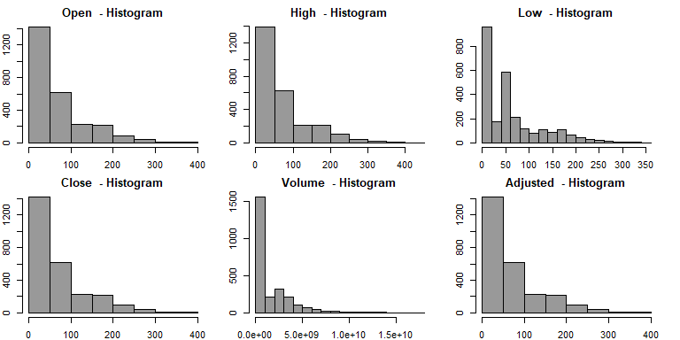

``` r
# boxplot distributions
par(mfrow = c(2, 3),
    mar = c(2, 2, 2, 2))

for (i in 1:ncol(litecoin_df)) {
    boxplot(litecoin_df[,i],
    ylab = names(litecoin_df[i]),
    main = paste(names(litecoin_df[i]), "- Boxplot"), horizontal=TRUE,
    col="gray")
  }
```

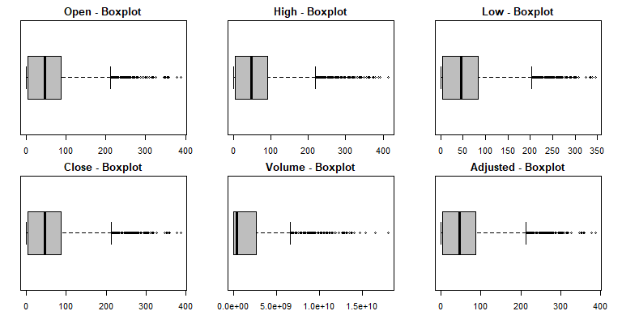
The OHLC (open, high, low, close) and adjusted prices exhibit
long-tailed distributions with a right skew; so does the volume.

Since we are interested in evaluating Litecoin’s performance as a
cryptocurrency, the final (close) price would be intrinsically of
interest; but, more importantly, the “adjusted closing price is
considered to be a more technically accurate reflection of the true
value” (Bischoff, 2019).

``` r
# test skewness by looking at mean and median relationship
mean_ltc <- round(apply(litecoin_df, 2, mean, na.rm = T),0)
median_ltc <- round(apply(litecoin_df, 2, median, na.rm = T),0)
distribution<- data.frame(mean_ltc, median_ltc)
distribution$Skewness <- ifelse(mean_ltc > 2 + median_ltc, "skewed", "normal")
distribution
```

    ##            mean_ltc median_ltc Skewness
    ## Open             64         46   skewed
    ## High             67         48   skewed
    ## Low              61         45   skewed
    ## Close            64         46   skewed
    ## Volume   1593186877  375924496   skewed
    ## Adjusted         64         46   skewed

``` r
# Check for exact skewness in LTC.Volume
skewValue <- apply(litecoin_df, 2, skewness, na.rm=T)
skewValue
```

    ##     Open     High      Low    Close   Volume Adjusted 
    ## 1.410603 1.453786 1.357228 1.406507 2.299834 1.406507

``` r
# Applying Box-Cox Transformation on skewed variable
trans <- preProcess(data.frame(litecoin_df), method=c("BoxCox"))
trans
```

    ## Created from 2628 samples and 6 variables
    ## 
    ## Pre-processing:
    ##   - Box-Cox transformation (6)
    ##   - ignored (0)
    ## 
    ## Lambda estimates for Box-Cox transformation:
    ## 0.2, 0.2, 0.2, 0.2, 0.1, 0.2

``` r
# look at and compare to transformed data
transformed <- predict(trans, data.frame(litecoin_df))
skew_transformed <- apply(transformed, 2, skewness, na.rm=T)
skew_transformed
```

    ##        Open        High         Low       Close      Volume    Adjusted 
    ## -0.06181721 -0.05492312 -0.07210481 -0.06325734 -0.38318043 -0.06325734

``` r
new_skew <- data.frame(skewValue, skew_transformed)
new_skew$Skew_Variance <- ifelse(skewValue < skew_transformed, "More skewed", 
                                 "Less skewed")
new_skew
```

    ##          skewValue skew_transformed Skew_Variance
    ## Open      1.410603      -0.06181721   Less skewed
    ## High      1.453786      -0.05492312   Less skewed
    ## Low       1.357228      -0.07210481   Less skewed
    ## Close     1.406507      -0.06325734   Less skewed
    ## Volume    2.299834      -0.38318043   Less skewed
    ## Adjusted  1.406507      -0.06325734   Less skewed

## Correlation Matrix

``` r
# assign correlation function call to variable
cor_ltc <- cor(litecoin_df) 
# plot the correlation table (matrix)
corrplot(cor_ltc,
         method="color",
         col=colorRampPalette(c("yellow",
                                "white",
                                "orange"))(200),
         addCoef.col = "black", 
         tl.col="black", tl.srt=45, type="lower")
```

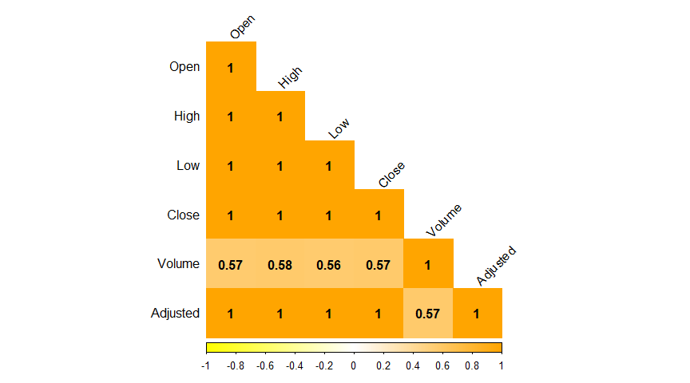
From the correlation matrix, it can be discerned that whereas the OHLC
and adjusted prices exhibit multicollinearity at *r* = 1, their
relationships with volume is much less pronounced, where
0.56 ≤ *r* ≤ 0.58.

## Principal Component Analysis (PCA)

``` r
# center, scale the data, and assign to PCA variable
litecoin.pca <- prcomp(litecoin_df, center = TRUE, scale. = TRUE)

# assign to variance explained variable 
var_explained <- round(litecoin.pca$sdev^2/sum((litecoin.pca$sdev)^2)*100, 4)
```

``` r
fviz_eig(litecoin.pca, main="Scree Plot of Six Principal Components",
         xlab="Principal Components", 
         ylab = "Percent Variance Explained",
         barcolor = "grey", barfill = "grey", 
         linecolor = "blue", addlabels=T,
         ggtheme=theme_classic())
```


| Principal Component | Percent Variance | Percent Change (Delta) |
|:-------------------:|:----------------:|:----------------------:|
|          1          |      89.35       |                        |
|          2          |      10.46       |          78.9          |
|          3          |       0.11       |         10.35          |
|          4          |       0.07       |          0.03          |
|          5          |       0.01       |          0.06          |
|          6          |        0         |          0.01          |

Approximately 89.35% of the variance in the data is explained by the
first principal component; thus, the effective dimension is 1. This is
supported by and demonstrated in the scree plot and the ensuing table
above. The table itself numerically demonstrates the percent variance
that is explained by each respective principal component. The scree plot
visually depicts “the percentage of the total variance explained by each
component” (Kuhn & Johnson, 2016, p. 38).

``` r
# create new variable for sole purpose of plotting years on x-axis, not indices
litecoin_plot <- ts(as.vector(litecoin.ts), start=c(2014), frequency = 365)
tsplot(litecoin_plot, main='LTC Adjusted Closing Prices (2014 - 2021)',
       xlab='Year', ylab='Adjusted Price (USD)') # plot the time series
```

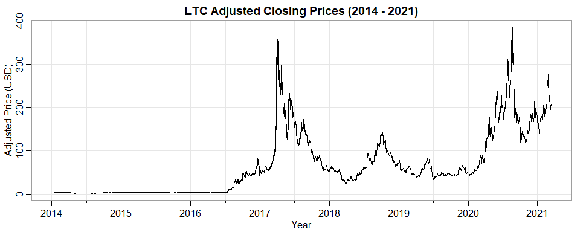
The time series shows a clear trend with several predominant peaks and
troughs, at approximately 2017 - 2018 and 2020 - 2021, respectively. To
mitigate (offset) the trend, differencing will be performed.
Furthermore, the autocorrelation function (ACF) and partial
autocorrelation function (PACF) are examined. Whereas ACF “measures the
linear predictability of the series at time *t*, say *x*<sub>*t*</sub>
using only the value of *x*<sub>*s*</sub>” (Shumway & Stoffer, 2019,
p. 20), the PACF does the same for a truncated lag length.

**Autocorrelation Function (ACF)**

where  − 1 ≤ *ρ*(*s*,*t*) ≤ 1.

For the sample ACF, we have:

``` r
par(mfrow=c(2,1), oma = c(2,2,0,0) + 0.1, mar = c(1,4,3,1) + 0.1)
acf(litecoin_df$Adjusted, lag.max=100, main='Litecoin ACF and PACF for Adjusted Prices')
pacf(litecoin_df$Adjusted, lag.max=100, main='', ylab='PACF')
```


Whereas the ACF gradually tapers off, the PACF cuts off after lag 1,
thereby relegating this to an AR(1) model. So we have the following:

``` r
arima(litecoin_df$Adjusted, order=c(1, 0, 0))
```

    ## 
    ## Call:
    ## arima(x = litecoin_df$Adjusted, order = c(1, 0, 0))
    ## 
    ## Coefficients:
    ##          ar1  intercept
    ##       0.9960    64.0773
    ## s.e.  0.0018    30.5462
    ## 
    ## sigma^2 estimated as 46.5:  log likelihood = -8776.55,  aic = 17559.09

## Smoothing and its Effects

We plot the data for the last six years (November 2014 through November
2021).

Next, we smooth the data by introducing the simple moving average (SMA),
and exponential moving average (EMA), respectively, weighting the
effects by 30 days (one full month).

``` r
chartSeries(litecoin_df, theme = chartTheme("white"))
```

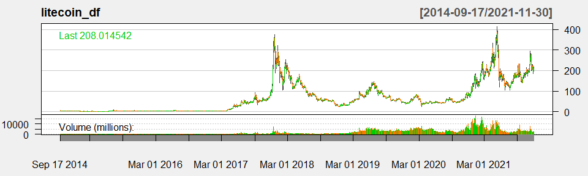

``` r
addSMA(30) # smoothed out moving average by 30 days
```


``` r
addEMA(30) # exponential moving average by 30 days
```


## Spectral Analysis Cyclical Behavior Periodogram Filters

``` r
par(mfrow=c(1,2)); ltcfreq <- mvspec(litecoin.ts,taper=0,log="no") # peaks
ltcfreq2 <- spec.pgram(litecoin.ts,taper=0,log="yes",
                       main ='Periodogram with CI') # graph confidence interval
```

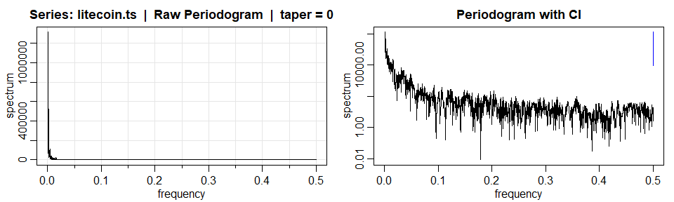

``` r
# sort the frequencies in descending order and get  top 2
sort_ltcfreq <- sort(ltcfreq$spec, decreasing = TRUE)[c(1,2)] 
p1 <- ltcfreq$freq[ltcfreq$spec==sort_ltcfreq[1]]; p1 
```

    ## [1] 0.0007407407

``` r
p2 <- ltcfreq$freq[ltcfreq$spec==sort_ltcfreq[2]]; p2
```

    ## [1] 0.001481481

``` r
cat('Cycles are occuring every', round(1/p1,1), 'days and ', 1/p2, 'days')
```

    ## Cycles are occuring every 1350 days and  675 days

``` r
CI <- function(peak_spec){ 
 u <- qchisq(0.025,2) 
 l <- qchisq(0.975,2) 
      c((2*peak_spec)/l,(2*peak_spec)/u)} # confidence intervals of the peaks 
CI(sort_ltcfreq[1]) # CI for peak 1 
```

    ## [1]   357264.8 52054543.7

``` r
CI(sort_ltcfreq[2]) # CI for peak 2
```

    ## [1]   149449.4 21775218.9

Dominant peak is ≈ 0.0. Each of the generic confidence intervals is too
wide to be of much use.

``` r
# nonparametric spectral estimation + graph the data with different tapering 
par(mfrow=c(2,2))
ltcfreq_taper0 = mvspec(litecoin.ts, spans=c(2,2), log="no", taper=0)
ltcfreq_taper2 = mvspec(litecoin.ts, spans=c(2,2), log="no", taper=0.2)
ltcfreq_taper5 = mvspec(litecoin.ts, spans=c(2,2), log="no", taper=0.5)
plot(ltcfreq_taper0$freq, ltcfreq_taper0$spec, log="y", type="l", 
     ylab="adjusted-spectrum", xlab="frequency", panel.first=Grid()) 
lines(ltcfreq_taper2$freq, ltcfreq_taper2$spec, col=2) 
lines(ltcfreq_taper5$freq, ltcfreq_taper5$spec, col=4) 
abline(v=1/16, lty=2) 
legend("bottomleft", legend=c("no taper", "20% taper", "50% taper"), lty=1, 
       col=c(1,2,4), bty="n")
```


By comparing the different tapering, we can see that having more
tapering can slightly decrease the degrees of freedom and enhances the
center of the data relative to the extremities. Thus we choose the
smoothing with 50% tapering.

# Preprocessing - Differencing

``` r
diff_ltc_1 <- diff(log(litecoin_plot))*100
tsplot(diff_ltc_1, main='Litecoin Continuous Compound Return',ylab='Return in %')
abline(h=mean(diff_ltc_1),col=6); cat('Mean return:', mean(diff_ltc_1)) 
```


    ## Mean return: 0.1414742

This can be likened to the Dow-Jones Industrial Average (DJIA), which is
the differenced data, and shows a mean of zero; this gives it the
stationary property.

``` r
par(mfrow=c(2,1), oma = c(1,1,0,0) + 0.09, mar = c(1,4,3,0.5) + 0.08)
acf(diff_ltc_1, lag.max=500, main = 'Differenced Litecoin Adjusted Prices')
pacf(diff_ltc_1, lag.max=500, main='', ylab='PACF')
```

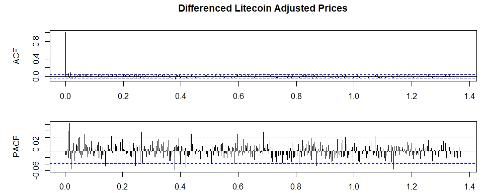

``` r
arima(diff_ltc_1, order=c(1,0,1)) # Introductory ARIMA model (1,0,1)
```

    ## 
    ## Call:
    ## arima(x = diff_ltc_1, order = c(1, 0, 1))
    ## 
    ## Coefficients:
    ##          ar1      ma1  intercept
    ##       0.3409  -0.3514     0.1457
    ## s.e.  0.4836   0.4728     0.1099
    ## 
    ## sigma^2 estimated as 32.77:  log likelihood = -8310.97,  aic = 16629.95

where *c* = 0.1457 × (1−0.3409) = 0.096031 and *ε*<sub>*t*</sub> is
white noise with a standard deviation of
$\\sqrt{\\sigma^2}=\\sqrt{32.77} = 5.725.$

``` r
par(mfrow=c(2,1))
litecoin_df$Return <- litecoin_df$Close/litecoin_df$Open-1
litecoin_df$Adj_Return <- litecoin_df$Adjusted/litecoin_df$Open-1

# plot return
tsplot(litecoin_df$Return, main='Litecoin Return Over Time: 2011-2021',
       ylab='Return') 
# plot adj.return
tsplot(litecoin_df$Adj_Return, main='Litecoin Adjusted Return: 2011-2021',
       ylab='Adjusted Return') 
```


# ARIMA Models

By differencing the data, we remove the trend, and can use the ARIMA
model.

At this stage, we can conclude our exploratory data analysis with a six
year historical pricing inquiry. Volatility shocks must be considered.

Cryptocurrency is a relatively new, ever-changing and ever-evolving
financial technology. For this reason, we will take more conservative
approach by forecasting five years out.

``` r
# create a few models and compare the AIC scores in a table
arima010 <- arima(litecoin_df$Adj_Return,order=c(0,1,0))
arima110 <- arima(litecoin_df$Adj_Return,order=c(1,1,0))
arima011 <- arima(litecoin_df$Adj_Return,order=c(0,1,1))
arima111 <- arima(litecoin_df$Adj_Return,order=c(1,1,1))
arima212 <- arima(litecoin_df$Adj_Return,order=c(2,1,2))
arima312 <- arima(litecoin_df$Adj_Return,order=c(3,1,2))

# find AIC for each model and assign to variable
sigma_2 <- c(arima010$sigma2, arima110$sigma2, arima011$sigma2, arima111$sigma2,
             arima212$sigma2, arima312$sigma2)

AIC <- c(arima010$aic, arima110$aic, arima011$aic, arima111$aic, arima212$aic,
         arima312$aic)

LOG <- c(arima010$loglik, arima110$loglik, arima011$loglik, arima111$loglik, 
         arima212$loglik, arima312$loglik)

rownames <- c('ARIMA(0,1,0)', 'ARIMA(1,1,0)', 'ARIMA(0,1,1)', 'ARIMA(1,1,1)',
              'ARIMA(2,1,2)', 'ARIMA(3,1,2)')

# place the data into a table
tableARIMA <- data.frame(rownames, sigma_2, LOG, AIC)

colnames(tableARIMA) <- c('Model', 'Sigma^2', ' Log Likelihood', 'AIC')
tableARIMA %>% pander(style ='simple', 
                      caption='ARIMA Models: Log Likelihood and AIC')
```

|    Model     | Sigma^2  | Log Likelihood |  AIC  |
|:------------:|:--------:|:--------------:|:-----:|
| ARIMA(0,1,0) | 0.006817 |      2825      | -5647 |
| ARIMA(1,1,0) | 0.005141 |      3195      | -6386 |
| ARIMA(0,1,1) | 0.003416 |      3730      | -7456 |
| ARIMA(1,1,1) | 0.003416 |      3730      | -7454 |
| ARIMA(2,1,2) | 0.003416 |      3730      | -7450 |
| ARIMA(3,1,2) | 0.003405 |      3733      | -7453 |

ARIMA Models: Log Likelihood and AIC

``` r
sarima(litecoin_df$Adj_Return, 3,1,2, details = FALSE) # the model with lowest AIC score
```

    ## $fit
    ## 
    ## Call:
    ## arima(x = xdata, order = c(p, d, q), seasonal = list(order = c(P, D, Q), period = S), 
    ##     xreg = constant, transform.pars = trans, fixed = fixed, optim.control = list(trace = trc, 
    ##         REPORT = 1, reltol = tol))
    ## 
    ## Coefficients:
    ##          ar1      ar2     ar3      ma1     ma2  constant
    ##       0.6628  -0.0082  0.0398  -1.6641  0.6641         0
    ## s.e.  0.1113   0.0234  0.0200   0.1114  0.1115         0
    ## 
    ## sigma^2 estimated as 0.003405:  log likelihood = 3732.76,  aic = -7451.52
    ## 
    ## $degrees_of_freedom
    ## [1] 2621
    ## 
    ## $ttable
    ##          Estimate     SE  t.value p.value
    ## ar1        0.6628 0.1113   5.9542  0.0000
    ## ar2       -0.0082 0.0234  -0.3504  0.7261
    ## ar3        0.0398 0.0200   1.9952  0.0461
    ## ma1       -1.6641 0.1114 -14.9324  0.0000
    ## ma2        0.6641 0.1115   5.9564  0.0000
    ## constant   0.0000 0.0000   0.0286  0.9772
    ## 
    ## $AIC
    ## [1] -2.836511
    ## 
    ## $AICc
    ## [1] -2.836499
    ## 
    ## $BIC
    ## [1] -2.82086

where *c* = 0 and *ε*<sub>*t*</sub> is white noise with a standard
deviation of $\\sqrt{\\sigma^2} = \\sqrt{0.003405}= 0.058352.$

## Optimal ARIMA Model

``` r
ltc.arima_opt <- tq_get("LTC-USD", from ="2015-01-01", to = "2021-09-30") %>%
select(adjusted) %>% # adjusted price (more accurate than close price)
ts(.) # turning it into a time series object
crypto_model <- auto.arima(ltc.arima_opt); crypto_model # Optimal ARIMA model
```

    ## Series: ltc.arima_opt 
    ## ARIMA(3,1,3) 
    ## 
    ## Coefficients:
    ##          ar1     ar2      ar3      ma1      ma2     ma3
    ##       0.6688  0.7767  -0.7404  -0.6954  -0.7546  0.7909
    ## s.e.  0.5612  0.3431   0.1273   0.5243   0.3831  0.1779
    ## 
    ## sigma^2 estimated as 46.41:  log likelihood=-8208.97
    ## AIC=16431.93   AICc=16431.98   BIC=16472.6

``` r
# forecast the next 41 closing prices, with a 95% CI   
ltc_forecast <- forecast(crypto_model, 41, level = c(.95)); ltc_forecast                  
```

    ##      Point Forecast     Lo 95    Hi 95
    ## 2466       152.6847 139.33254 166.0369
    ## 2467       152.8352 134.20225 171.4681
    ## 2468       153.4791 130.72922 176.2291
    ## 2469       154.3697 127.92189 180.8175
    ## 2470       155.3541 125.38883 185.3193
    ## 2471       156.2272 122.81387 189.6405
    ## 2472       156.9163 120.12849 193.7040
    ## 2473       157.3264 117.25122 197.4016
    ## 2474       157.4894 114.26737 200.7113
    ## 2475       157.4067 111.20322 203.6101
    ## 2476       157.1743 108.18792 206.1606
    ## 2477       156.8340 105.26026 208.4077
    ## 2478       156.4871 102.52114 210.4531
    ## 2479       156.1629  99.97227 212.3535
    ## 2480       155.9287  97.66111 214.1962
    ## 2481       155.7770  95.54545 216.0086
    ## 2482       155.7337  93.62908 217.8384
    ## 2483       155.7605  91.84472 219.6762
    ## 2484       155.8570  90.17816 221.5358
    ## 2485       155.9744  88.56290 223.3858
    ## 2486       156.1080  86.99076 225.2253
    ## 2487       156.2171  85.41387 227.0203
    ## 2488       156.3070  83.84153 228.7724
    ## 2489       156.3528  82.24802 230.4576
    ## 2490       156.3725  80.65770 232.0873
    ## 2491       156.3547  79.05945 233.6500
    ## 2492       156.3242  77.48299 235.1654
    ## 2493       156.2754  75.92120 236.6296
    ## 2494       156.2322  74.40000 238.0644
    ## 2495       156.1880  72.90904 239.4670
    ## 2496       156.1611  71.46629 240.8559
    ## 2497       156.1407  70.05638 242.2250
    ## 2498       156.1389  68.69022 243.5875
    ## 2499       156.1418  67.34965 244.9339
    ## 2500       156.1574  66.04200 246.2727
    ## 2501       156.1714  64.74976 247.5931
    ## 2502       156.1908  63.48003 248.9015
    ## 2503       156.2031  62.21833 250.1879
    ## 2504       156.2160  60.97316 251.4587
    ## 2505       156.2198  59.73354 252.7060
    ## 2506       156.2232  58.50920 253.9372

``` r
# actual prices used for plot below
actual_price <- tq_get("LTC-USD", from = "2015-01-01", to = "2021-11-30") %>%
  select(adjusted) %>% ts(.)
# Plotting forecasted prices against the actual prices
autoplot(ltc_forecast, xlab='Time (Indexed)',ylab=('Litecoin Adjusted Price')) +
  autolayer(window(actual_price, start = 2300), size=1) +
  theme_classic() +
  theme(legend.position = "") +
  ylim(0, 500)+
  coord_cartesian(xlim = c(2200,2510))
```

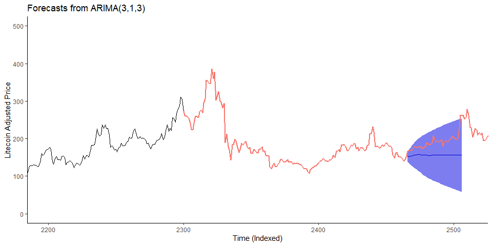

## Diagnostics for Optimal ARIMA Model

``` r
sarima(litecoin_df$Adj_Return, 3,1,3)
```

    ## initial  value -2.493863 
    ## iter   2 value -2.715988
    ## iter   3 value -2.764973
    ## iter   4 value -2.808328
    ## iter   5 value -2.819179
    ## iter   6 value -2.820811
    ## iter   7 value -2.823961
    ## iter   8 value -2.830462
    ## iter   9 value -2.834061
    ## iter  10 value -2.836192
    ## iter  11 value -2.837421
    ## iter  12 value -2.837597
    ## iter  13 value -2.837726
    ## iter  14 value -2.837759
    ## iter  15 value -2.837770
    ## iter  16 value -2.837810
    ## iter  17 value -2.837810
    ## iter  18 value -2.837811
    ## iter  19 value -2.837844
    ## iter  20 value -2.837855
    ## iter  21 value -2.837953
    ## iter  22 value -2.838398
    ## iter  23 value -2.838680
    ## iter  24 value -2.838877
    ## iter  25 value -2.839033
    ## iter  26 value -2.839360
    ## iter  27 value -2.839747
    ## iter  28 value -2.840184
    ## iter  29 value -2.840496
    ## iter  29 value -2.840496
    ## iter  30 value -2.840544
    ## iter  30 value -2.840544
    ## iter  31 value -2.840552
    ## iter  31 value -2.840552
    ## iter  31 value -2.840552
    ## final  value -2.840552 
    ## converged
    ## initial  value -2.838511 
    ## iter   2 value -2.838563
    ## iter   3 value -2.838716
    ## iter   4 value -2.838742
    ## iter   5 value -2.838783
    ## iter   6 value -2.838788
    ## iter   7 value -2.838790
    ## iter   8 value -2.838792
    ## iter   9 value -2.838795
    ## iter  10 value -2.838799
    ## iter  11 value -2.838800
    ## iter  12 value -2.838801
    ## iter  13 value -2.838801
    ## iter  14 value -2.838802
    ## iter  15 value -2.838804
    ## iter  16 value -2.838809
    ## iter  17 value -2.838809
    ## iter  18 value -2.838811
    ## iter  19 value -2.838818
    ## iter  20 value -2.838818
    ## iter  21 value -2.838819
    ## iter  22 value -2.838819
    ## iter  23 value -2.838824
    ## iter  24 value -2.838833
    ## iter  25 value -2.838850
    ## iter  26 value -2.838878
    ## iter  27 value -2.838972
    ## iter  28 value -2.839057
    ## iter  29 value -2.839191
    ## iter  30 value -2.839218
    ## iter  31 value -2.839286
    ## iter  32 value -2.839286
    ## iter  33 value -2.839286
    ## iter  34 value -2.839291
    ## iter  35 value -2.839292
    ## iter  36 value -2.839292
    ## iter  37 value -2.839294
    ## iter  38 value -2.839297
    ## iter  39 value -2.839305
    ## iter  40 value -2.839314
    ## iter  41 value -2.839324
    ## iter  42 value -2.839329
    ## iter  43 value -2.839329
    ## iter  43 value -2.839329
    ## iter  43 value -2.839329
    ## final  value -2.839329 
    ## converged

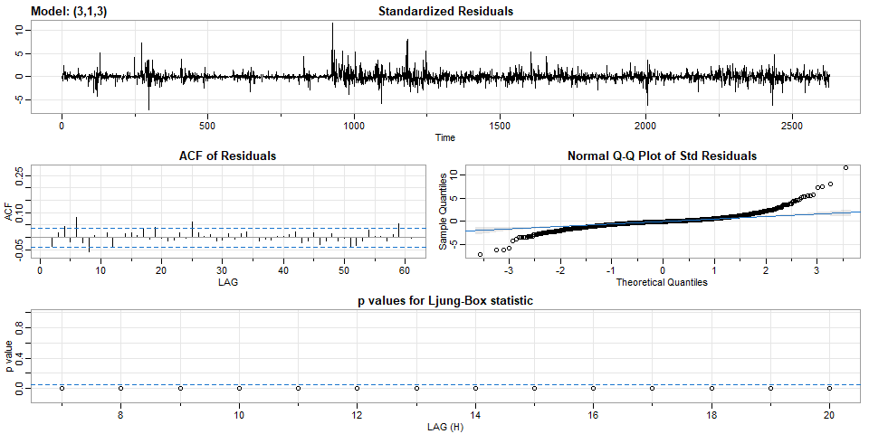

    ## $fit
    ## 
    ## Call:
    ## arima(x = xdata, order = c(p, d, q), seasonal = list(order = c(P, D, Q), period = S), 
    ##     xreg = constant, transform.pars = trans, fixed = fixed, optim.control = list(trace = trc, 
    ##         REPORT = 1, reltol = tol))
    ## 
    ## Coefficients:
    ##           ar1     ar2      ar3      ma1      ma2     ma3  constant
    ##       -0.1813  0.5661  -0.0023  -0.8161  -0.7215  0.5399         0
    ## s.e.   0.2028  0.1715   0.0203   0.2014   0.1493  0.1709         0
    ## 
    ## sigma^2 estimated as 0.003412:  log likelihood = 3731.37,  aic = -7446.73
    ## 
    ## $degrees_of_freedom
    ## [1] 2620
    ## 
    ## $ttable
    ##          Estimate     SE t.value p.value
    ## ar1       -0.1813 0.2028 -0.8941  0.3713
    ## ar2        0.5661 0.1715  3.3019  0.0010
    ## ar3       -0.0023 0.0203 -0.1111  0.9116
    ## ma1       -0.8161 0.2014 -4.0531  0.0001
    ## ma2       -0.7215 0.1493 -4.8315  0.0000
    ## ma3        0.5399 0.1709  3.1597  0.0016
    ## constant   0.0000 0.0000  0.0777  0.9381
    ## 
    ## $AIC
    ## [1] -2.834691
    ## 
    ## $AICc
    ## [1] -2.834675
    ## 
    ## $BIC
    ## [1] -2.816804

        where *c* = 0 and *ε*<sub>*t*</sub> is white noise with a
standard deviation of $\\sqrt{\\sigma^2}=\\sqrt{0.003412} = 0.05841233.$

  

-   Standard Residuals: trend-less and white noise-like.  
-   ACF of Residuals: cuts off after lag 1 indicating its MA behavior.  
-   Normal Q-Q Plot of Std Residuals: assumption of normality is
    reasonable w/ some outliers at the tails.  
-   The *p*-values for Ljung-Box statistic: all *p*-values are under
    0.0, indicating Q-Statistic is insignificant which means our model
    may fit really nicely.

## Calculate Annualized Volatility

``` r
return = CalculateReturns(ltc_xts$Adjusted)
return = return[-1,]
chart.RollingPerformance(R = return, FUN="sd.annualized", scale=365, width=12, 
                         main="LTC-USD Annualized Volatility")
```

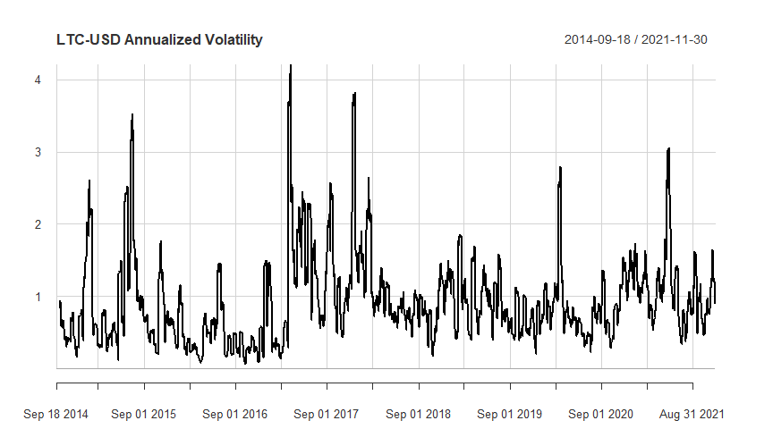

``` r
volatility <- sd(return)
rolling_window <- sqrt(365)*sd(return["2021"])

rownames <- c('Metric')

table_vol<- data.frame(rownames, volatility, rolling_window)
colnames(table_vol)<-c(' ','Annualized Volatility', 'Rolling Window Volatility')
table_vol %>% pander(style ='simple', caption='Litecoin Volatility of Return')
```

|        | Annualized Volatility | Rolling Window Volatility |
|--------|:---------------------:|:-------------------------:|
| Metric |        0.05838        |           1.189           |

Litecoin Volatility of Return

``` r
acf2(return, main='Litecoin Annualized Volatility - ACF and PACF')
```

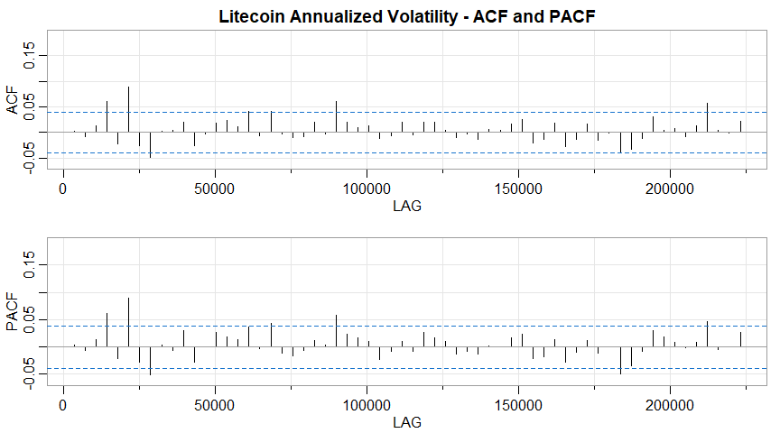

    ##      [,1]  [,2] [,3] [,4]  [,5] [,6]  [,7]  [,8] [,9] [,10] [,11] [,12] [,13]
    ## ACF     0 -0.01 0.01 0.06 -0.02 0.09 -0.03 -0.05    0  0.00  0.02 -0.03     0
    ## PACF    0 -0.01 0.01 0.06 -0.02 0.09 -0.03 -0.05    0 -0.01  0.03 -0.03     0
    ##      [,14] [,15] [,16] [,17] [,18] [,19] [,20] [,21] [,22] [,23] [,24] [,25]
    ## ACF   0.02  0.02  0.01  0.04 -0.01  0.04  0.00 -0.01 -0.01  0.02     0  0.06
    ## PACF  0.03  0.02  0.01  0.04  0.00  0.04 -0.01 -0.02 -0.01  0.01     0  0.06
    ##      [,26] [,27] [,28] [,29] [,30] [,31] [,32] [,33] [,34] [,35] [,36] [,37]
    ## ACF   0.02  0.01  0.01 -0.01 -0.01  0.02 -0.01  0.02  0.02  0.00 -0.01  0.00
    ## PACF  0.02  0.02  0.01 -0.02 -0.01  0.01 -0.01  0.03  0.02  0.01 -0.01 -0.01
    ##      [,38] [,39] [,40] [,41] [,42] [,43] [,44] [,45] [,46] [,47] [,48] [,49]
    ## ACF  -0.01  0.01     0  0.02  0.03 -0.02 -0.01  0.02 -0.03 -0.01  0.02 -0.02
    ## PACF -0.01  0.00     0  0.02  0.02 -0.02 -0.02  0.01 -0.03 -0.01  0.01 -0.01
    ##      [,50] [,51] [,52] [,53] [,54] [,55] [,56] [,57] [,58] [,59] [,60] [,61]
    ## ACF      0 -0.04 -0.03 -0.01  0.03  0.01  0.01 -0.01  0.01  0.06  0.00     0
    ## PACF     0 -0.05 -0.03 -0.01  0.03  0.02  0.01  0.00  0.01  0.05 -0.01     0
    ##      [,62]
    ## ACF   0.02
    ## PACF  0.03

From the graph above, we can see that the annualized volatility is
throughout the entire history of existence of LTC, with various
magnitudes through different months. This leading to GARCH/conditional
volatility.

# GARCH Model

``` r
model1 = ugarchspec(mean.model = list(armaorder = c(0,0)),
                    variance.model = list(model = "sGARCH", garchorder=c(1,1)),
                    distribution.model='sstd')

##############################################
# model fitting
model_fitting=ugarchfit(data = return, spec = model1, out.sample=20)
model_fitting
```

    ## 
    ## *---------------------------------*
    ## *          GARCH Model Fit        *
    ## *---------------------------------*
    ## 
    ## Conditional Variance Dynamics    
    ## -----------------------------------
    ## GARCH Model  : sGARCH(1,1)
    ## Mean Model   : ARFIMA(1,0,1)
    ## Distribution : sstd 
    ## 
    ## Optimal Parameters
    ## ------------------------------------
    ##         Estimate  Std. Error  t value Pr(>|t|)
    ## mu      0.000735    0.000524   1.4027 0.160717
    ## ar1     0.418107    0.157935   2.6473 0.008113
    ## ma1    -0.497210    0.150026  -3.3142 0.000919
    ## omega   0.000016    0.000007   2.2844 0.022348
    ## alpha1  0.097471    0.011706   8.3264 0.000000
    ## beta1   0.901529    0.013195  68.3219 0.000000
    ## skew    1.067920    0.023746  44.9724 0.000000
    ## shape   3.018354    0.128460  23.4965 0.000000
    ## 
    ## Robust Standard Errors:
    ##         Estimate  Std. Error  t value Pr(>|t|)
    ## mu      0.000735    0.000551   1.3349 0.181904
    ## ar1     0.418107    0.166875   2.5055 0.012228
    ## ma1    -0.497210    0.158516  -3.1367 0.001709
    ## omega   0.000016    0.000013   1.2280 0.219459
    ## alpha1  0.097471    0.015074   6.4663 0.000000
    ## beta1   0.901529    0.023431  38.4755 0.000000
    ## skew    1.067920    0.023843  44.7894 0.000000
    ## shape   3.018354    0.146389  20.6187 0.000000
    ## 
    ## LogLikelihood : 4577.366 
    ## 
    ## Information Criteria
    ## ------------------------------------
    ##                     
    ## Akaike       -3.5055
    ## Bayes        -3.4875
    ## Shibata      -3.5055
    ## Hannan-Quinn -3.4989
    ## 
    ## Weighted Ljung-Box Test on Standardized Residuals
    ## ------------------------------------
    ##                         statistic       p-value
    ## Lag[1]                      12.05 0.00051805882
    ## Lag[2*(p+q)+(p+q)-1][5]     17.01 0.00000000000
    ## Lag[4*(p+q)+(p+q)-1][9]     20.75 0.00000002785
    ## d.o.f=2
    ## H0 : No serial correlation
    ## 
    ## Weighted Ljung-Box Test on Standardized Squared Residuals
    ## ------------------------------------
    ##                         statistic p-value
    ## Lag[1]                    0.03717  0.8471
    ## Lag[2*(p+q)+(p+q)-1][5]   0.13202  0.9967
    ## Lag[4*(p+q)+(p+q)-1][9]   0.21580  0.9999
    ## d.o.f=2
    ## 
    ## Weighted ARCH LM Tests
    ## ------------------------------------
    ##             Statistic Shape Scale P-Value
    ## ARCH Lag[3]   0.05465 0.500 2.000  0.8152
    ## ARCH Lag[5]   0.12590 1.440 1.667  0.9818
    ## ARCH Lag[7]   0.16175 2.315 1.543  0.9982
    ## 
    ## Nyblom stability test
    ## ------------------------------------
    ## Joint Statistic:  19.2766
    ## Individual Statistics:              
    ## mu     0.11840
    ## ar1    0.07957
    ## ma1    0.08344
    ## omega  1.70341
    ## alpha1 1.67979
    ## beta1  2.04314
    ## skew   0.12408
    ## shape  6.02957
    ## 
    ## Asymptotic Critical Values (10% 5% 1%)
    ## Joint Statistic:          1.89 2.11 2.59
    ## Individual Statistic:     0.35 0.47 0.75
    ## 
    ## Sign Bias Test
    ## ------------------------------------
    ##                    t-value   prob sig
    ## Sign Bias           1.4538 0.1461    
    ## Negative Sign Bias  0.2108 0.8330    
    ## Positive Sign Bias  1.2293 0.2191    
    ## Joint Effect        3.3001 0.3476    
    ## 
    ## 
    ## Adjusted Pearson Goodness-of-Fit Test:
    ## ------------------------------------
    ##   group statistic p-value(g-1)
    ## 1    20     37.41     0.007046
    ## 2    30     54.32     0.002969
    ## 3    40     56.28     0.036107
    ## 4    50     69.24     0.029979
    ## 
    ## 
    ## Elapsed time : 0.7653661

``` r
##############################################

# plot
plot(model_fitting,which="all")
```

    ## 
    ## please wait...calculating quantiles...

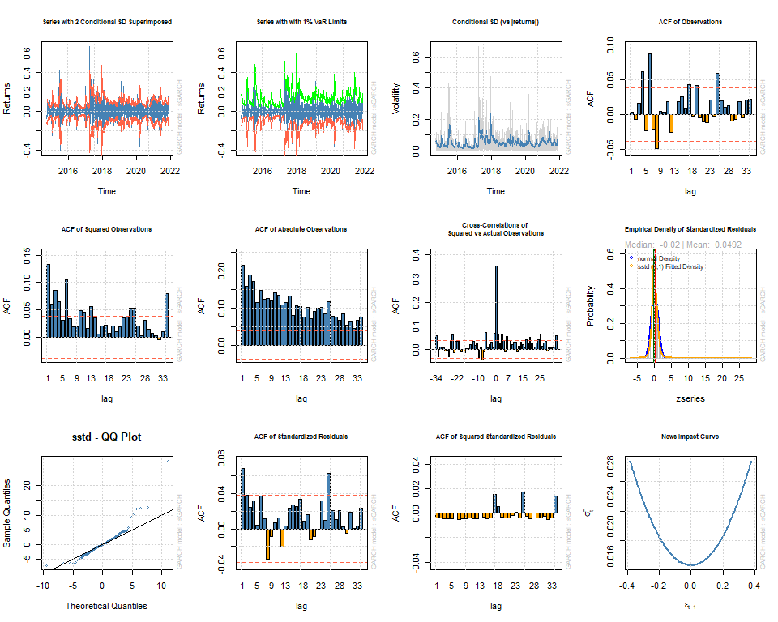

``` r
par(mfrow=c(2,1), 
    oma = c(1.5,0.5,0,0) + 0.10, 
    mar = c(5,4,3,2) -0.10)
plot(model_fitting, which=2)
```

    ## 
    ## please wait...calculating quantiles...

``` r
plot(model_fitting, which=3)
```

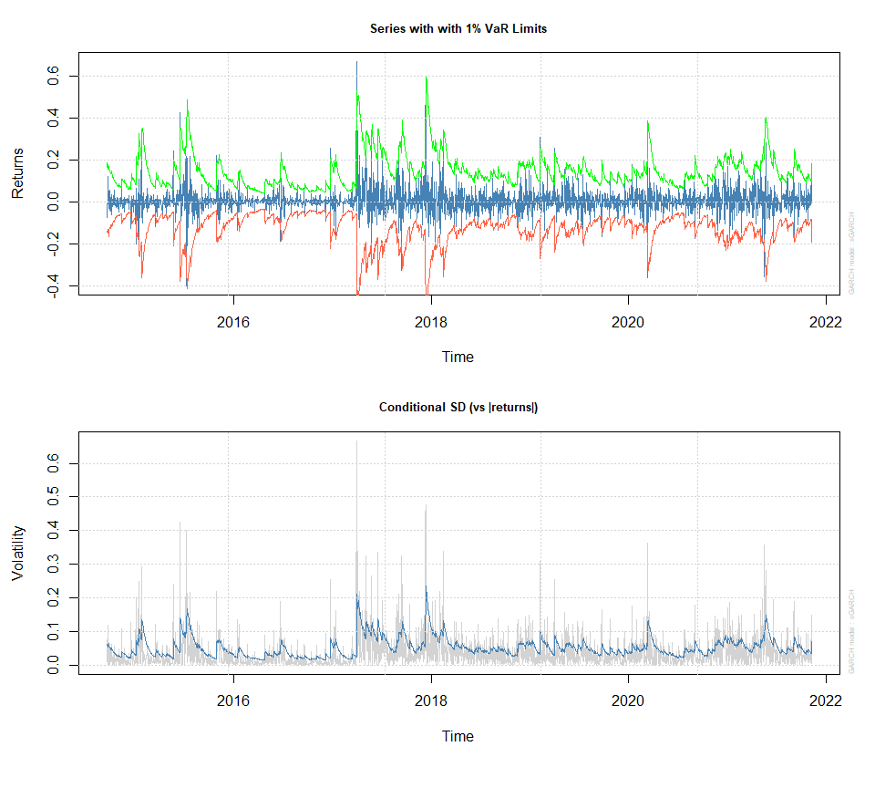

Bischoff, B. & Cockerham, R. (2019, March 31). Adjusted Closing Price
vs. Closing Price. *Zacks.*  
<https://finance.zacks.com/adjusted-closing-price-vs-closing-price-9991.html>

Kuhn, M., & Johnson, K. (2016). *Applied Predictive Modeling.*
Springer.  
<https://doi.org/10.1007/978-1-4614-6849-3>

Shumway, R., & Stoffer, D. (2019). *Time Series: A Data Analysis
Approach Using R.* Chapman and Hall/CRC.
