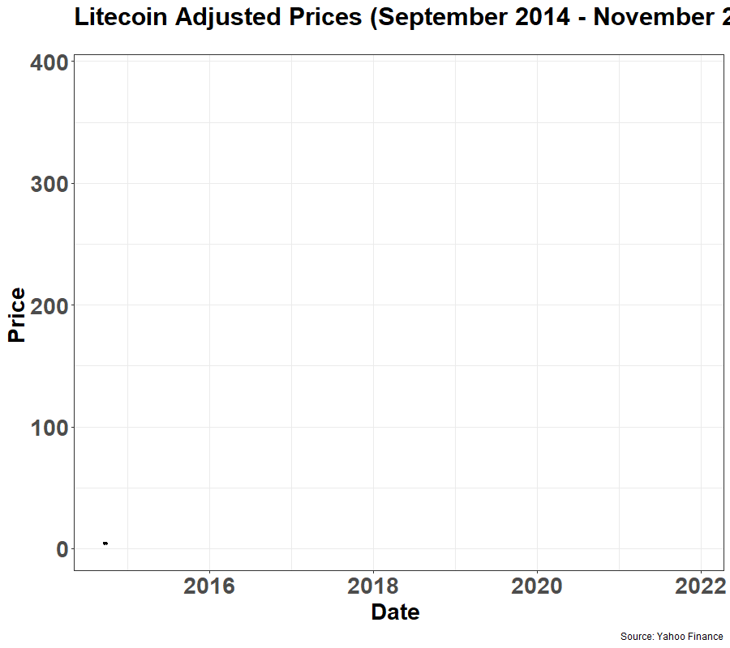
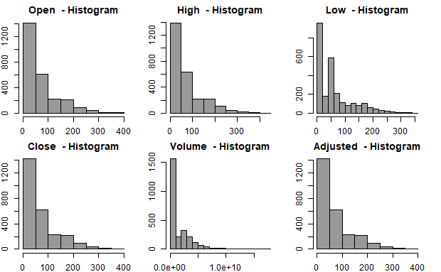
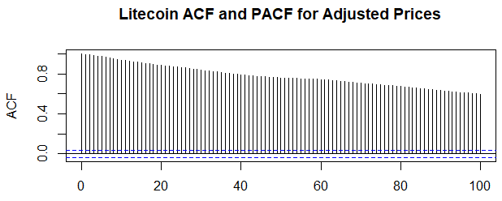
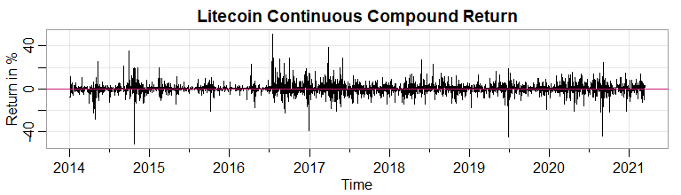
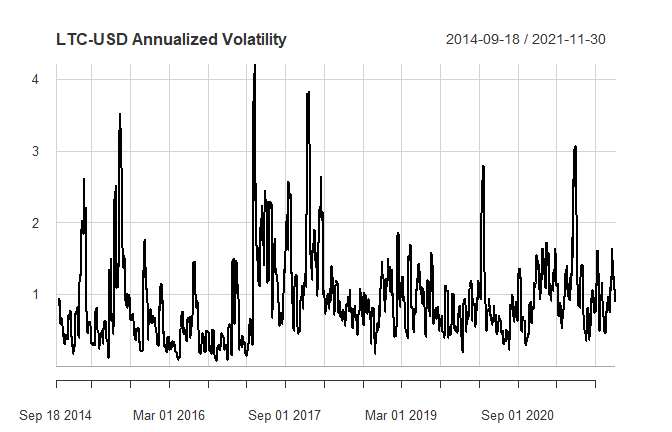

  

  

# Litecoin Cryptocurrency Forecast – Variations on the Autoregressive Moving Average Model: A Time Series Analysis

### Project Status: Completed

### Installation

To use this project, first clone the repo on your device using the commands below:

`git init`

`git clone https://github.com/MSADS-506-Applied-Time-Series-Analysis/litecoin_predictions.git`

### Project Intro/Objective

After being founded in 2011 by Charlie Lee as a peer-to-peer digital currency, Litecoin Foundation has experienced a fair share of peaks and troughs in the cryptocurrency space for reasons not affected by price alone. For example, many people still remain skeptical as to the real value behind the blockchain phenomenon that was largely exacerbated by the explosion of bitcoin (BTC). Litecoin came soon after, trading substantially low at roughly $3.00 per coin.  We endeavor to analyze the behaviors and patterns of litecoin for the past six years and use (i.e. seasonal) models to forecast a sound and proper price trajectory that will give prospective (especially conservative) investors a healthy outlook for future growth.

### Partner(s)/Contributor(s) 

* [Leonid Shpaner](https://www.leonshpaner.com)
* [Dingyi Duan](https://github.com/dingyiduan7)

### Methods Used
* Time Series Analysis
* Inferential Statistics
* Data Mining
* Predictive Modeling
* Data Visualization
* Programming
* Case Study 

### Technologies
* R 

### Dataset
* Source: [https://finance.yahoo.com/quote/LTC-USD/history?p=LTC-USD](https://finance.yahoo.com/quote/LTC-USD/history?p=LTC-USD)

While the dataset is readily available through Yahoo Finance, we use the `quantmod` package to access it in R. 

### Project Description

The data is presented as a time series object which is subsequently converted into a data frame and assigned to its own unique variable. The dataset contains 2,632 rows, representing the date range of September 17, 2014 through November 30, 2021, and 6 columns (variables), corresponding to open, high, low, close (adjusted prices), and volume.

**Data Analysis, Visualization, and Modeling**  
For exploratory data analysis, we check the distribution of data using histograms and boxplots as follows.

  
  

A subsequent Box-Cox transformation tackles the skewness dilemma.

The sample ACF shows a slow dampening which indicates a long memory process. The presence of non-stationarity can be established visa vie trend alone.

  

First order differencing is a pre-processing step necessary for converting the non-stationary time series object into one that is stationary (continuous compound returns):

  

Volatility shocks are calculated by the standard deviation of the return over annualized time:

  

The following models are used:
* ARIMA(3,1,3)
* GARCH(1,1)

The visualizations for the models include: 
* Histograms
* Boxplots
* Scree plot
* Time Series Plots
* Periodograms

Roadblocks/ Challenges
* More data would only stand to benefit the analytics framework.
* Additional GARCH modeling should lend itself to a more robust analysis, whereby at least a one-step ahead forecast can be made.

### License
MIT License  
Copyright (c) 2018  
Permission is hereby granted, free of charge, to any person obtaining a copy of this software and associated documentation files (the "Software"), to deal in the Software without restriction, including without limitation the rights to use, copy, modify, merge, publish, distribute, sublicense, and/or sell copies of the Software, and to permit persons to whom the Software is furnished to do so, subject to the following conditions:

The above copyright notice and this permission notice shall be included in all copies or substantial portions of the Software. THE SOFTWARE IS PROVIDED "AS IS", WITHOUT WARRANTY OF ANY KIND, EXPRESS OR IMPLIED, INCLUDING BUT NOT LIMITED TO THE WARRANTIES OF MERCHANTABILITY, FITNESS FOR A PARTICULAR PURPOSE AND NONINFRINGEMENT. IN NO EVENT SHALL THE AUTHORS OR COPYRIGHT HOLDERS BE LIABLE FOR ANY CLAIM, DAMAGES OR OTHER LIABILITY, WHETHER IN AN ACTION OF CONTRACT, TORT OR OTHERWISE, ARISING FROM, OUT OF OR IN CONNECTION WITH THE SOFTWARE OR THE USE OR OTHER DEALINGS IN THE SOFTWARE.

### Acknowledgements
Thank you Professors Erin Cooke and Rick Sanchez for your guidance in facilitating this project. Moreover, thank you to everyone involved as contributors to this repository.
