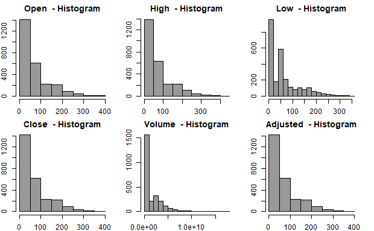
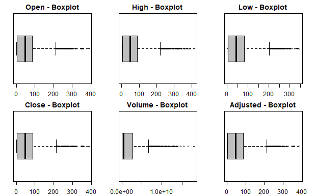

  

  

    
  

# Litecoin Cryptocurrency Forecast – Variations on the Autoregressive Moving Average Model: A Time Series Analysis

### Project Status: Completed

### Installation

To use this project, first clone the repo on your device using the commands below:

`git init`

`git clone https://github.com/MSADS-506-Applied-Time-Series-Analysis/litecoin_predictions.git`

### Project Intro/Objective

After being founded in 2011 by Charlie Lee as a peer-to-peer digital currency, Litecoin Foundation has experienced a fair share of peaks and troughs in the cryptocurrency space for reasons not affected by price alone. For example, many people still remain skeptical as to the real value behind the blockchain phenomenon that was largely exacerbated by the explosion of bitcoin (BTC). Litecoin came soon after, trading substantially low at roughly $3.00 per coin.  We endeavor to analyze the behaviors and patterns of litecoin for the past six years and use (i.e. seasonal) models to forecast a sound and proper price trajectory that will give prospective (especially conservative) investors a healthy outlook for future growth.

### Partner(s)/Contributor(s) 

* [Leonid Shpaner](https://www.leonshpaner.com)
* [Dingyi Duan](https://github.com/dingyiduan7)

### Methods Used
* Time Series Analysis
* Inferential Statistics
* Data Mining
* Predictive Modeling
* Data Visualization
* Programming
* Case Study 

### Technologies
* R 

### Dataset
* Source: [https://finance.yahoo.com/quote/LTC-USD/history?p=LTC-USD](https://finance.yahoo.com/quote/LTC-USD/history?p=LTC-USD)

While the dataset is readily available through Yahoo Finance, we use the quantmod package to access it in R. 

### Project Description

The data is presented as a time series object which is subsequently converted into a data frame and assigned to its own unique variable. The dataset contains 2,632 rows, representing the date range of September 17, 2014 through November 30, 2021, and 6 columns (variables), corresponding to open, high, low, close (adjusted prices), and volume.

**Data Analysis, Visualization, and Modeling**  
For exploratory data analysis, we check the distribution of data using histograms and boxplots as follows.

  

  
  
